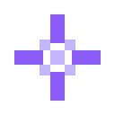

# Sprite: an embeddable scripting language in Rust

Sprite is a tiny, embeddable scripting language written from scratch in Rust: a one-pass lexer, a recursive-descent parser, and a tree-walking interpreter, small enough to read start to finish in one sitting. Drop it into any Rust program with a single `eval(source) -> Value` call, or keep a persistent `Session` for a REPL or a long-lived scripting host. It is both a readable reference interpreter and a near-zero-footprint scripting layer for embedding.

**[Live demo](https://pavanchow.github.io/sprite/)** · MIT licensed · written in Rust

Most embeddable scripting languages carry decades of features, corner cases,
and thousands of lines of C. Sprite is a scripting language in Rust built the
other way around: a lexer, a recursive-descent parser, and a tree-walking
interpreter, small enough to read start to finish over coffee, with a single
`eval(source) -> Value` function to drop into any Rust program.

If you want Lua or Rhai, they are excellent and much more capable. If you
want to understand every line of the interpreter running your script, or you
need a scripting layer with almost no footprint, Sprite is for that.

## Why it's tiny

- One pass tokenizer, no external lexer generator.
- One recursive-descent parser producing a plain AST.
- One tree-walking interpreter, no bytecode compiler, no VM.
- A handful of value types: numbers, strings, booleans, `nil`, and functions.
- No standard library beyond `print`. You decide what your embedding exposes.

## Language tour

```
let x = 2 + 3 * 4
print(x)                 # 14

let name = "world"
print("hello " + name)   # hello world

fn fact(n) {
    if n <= 1 {
        return 1
    }
    return n * fact(n - 1)
}
print(fact(5))            # 120

let i = 1
let sum = 0
while i <= 10 {
    sum = sum + i
    i = i + 1
}
print(sum)                 # 55

fn make_counter() {
    let count = 0
    fn increment() {
        count = count + 1
        return count
    }
    return increment
}
let counter = make_counter()
print(counter())           # 1
print(counter())           # 2
```

Values: numbers are `f64`, strings support `+` concatenation, booleans are
`true`/`false`, and `nil` is the absence of a value. Comparisons return
booleans. `and`, `or`, `not` are keywords, not symbols. Functions close over
their defining environment, so counters and accumulators work as you would
expect from any language with closures.

## Embedding

Add it to `Cargo.toml`:

```toml
[dependencies]
sprite = { git = "https://github.com/pavanchow/sprite" }
```

One-shot evaluation:

```rust
let value = sprite::eval("2 + 3 * 4").unwrap();
assert_eq!(value.to_string(), "14");
```

A persistent session, useful for a REPL or a long-lived scripting host where
variables and functions should survive between calls:

```rust
let mut session = sprite::Session::new();
session.run("let score = 0").unwrap();
session.run("score = score + 10").unwrap();
let v = session.run("score").unwrap();
assert_eq!(v.to_string(), "10");
```

Errors never panic on bad input. `eval` and `Session::run` return
`Result<Value, SpriteError>`, with `SpriteError::Lex`, `Parse`, and `Runtime`
variants, each carrying a message.

## Usage

Run a script file:

```
sprite run examples/factorial.sprite
```

Start a REPL:

```
sprite
```

Example scripts live in `examples/`.

## Building from source

```
git clone https://github.com/pavanchow/sprite
cd sprite
cargo build --release
cargo test
```

## Design

See [DESIGN.md](DESIGN.md) for the grammar, the lexer/parser/interpreter
pipeline, the value model, and how Sprite guards against stack overflow on
hostile input.

## Status

Sprite implements variables, arithmetic, comparisons, booleans, `if/else`,
`while`, functions with closures, recursion, and string concatenation. It is
a teaching-sized interpreter and an embeddable scripting language for small
Rust programs, not a general-purpose language runtime.

## License

MIT licensed. By Pavan Nallamothu.
